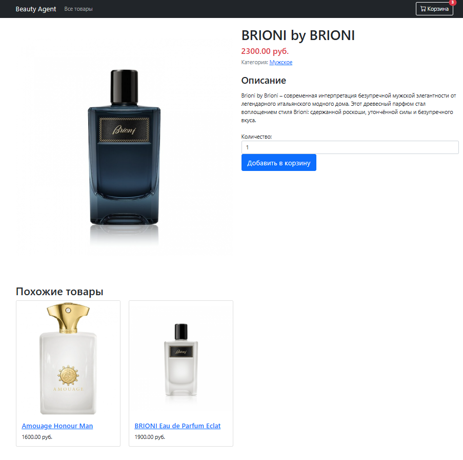
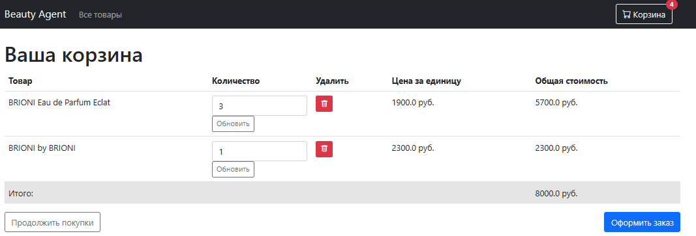
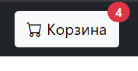
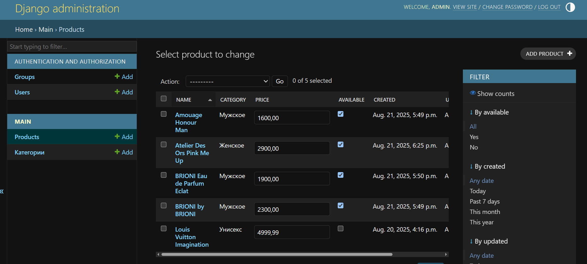

# Интернет-магазин на Django

## Запуск проекта на Linux
1. sudo apt install -y python3-venv 
2. python -m venv venv  OR  python3 -m venv venv
3. source venv/bin/activate
4. python3 django-ws/manage.py runserver
5. http://127.0.0.1:8000/

## Главная страница

## Главная страница с сортировкой по убыванию цены

## Карточка товара + рекомендация похожих товаров

## Корзина 

## Число товаров сохраняется при переходе на главную страницу

## Админка

